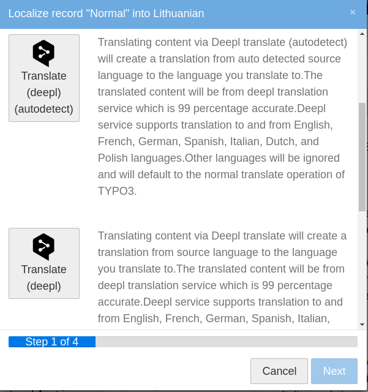
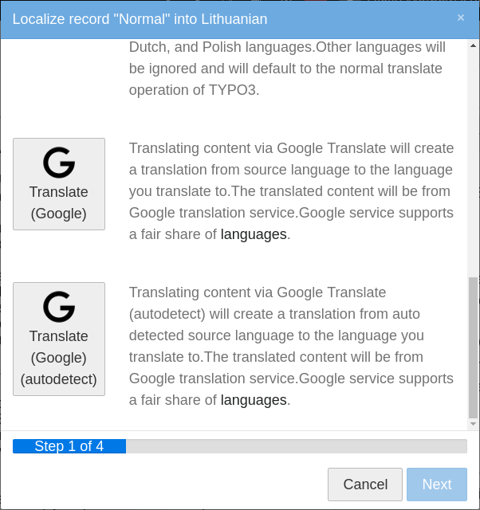
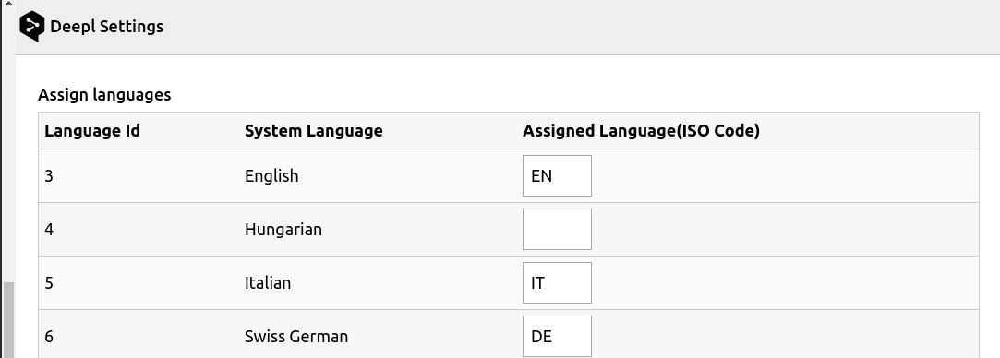

.. include:: ../Includes.rst.txt

.. _users-manual:

Users manual
============

Translating content elements
----------------------------

Once the extension is installed and API key provided, we are good to go for
translating content elements. On translating content element, there appears
additional four options apart from normal translate and copy.

* Deepl Translate(auto detect).
* Deepl Translate.
* Google Translate(auto detect).
* Google Translate.

    Deepl translate options

    Google translate options

Deepl Module Settings
-------------------------------

The settings module helps to assign the system languages to either DeepL
supported languages or to Google supported languages.

For example you can assign German to Austrian German sys language if you wish.
For assigning a language to a sys language you must enter it's iso code (ISO 639-1).

    Module Settings

Translating TCA Records
-----------------------

Deepltranslate supports translation of specific fields of TCA records. It
understands fields which need to be translated, only if their ``l10n_mode``
is set to ``prefixLangTitle``.

Example
-------

Translating fields from ``tx_news``
^^^^^^^^^^^^^^^^^^^^^^^^^^^^^^^^^^^

Add the fields, you want to auto translate to TCA/Overrides:
``EXT:sitepackage/Configuration/TCA/Overrides/tx_news_domain_model_news.php``

.. code-block:: php

   $GLOBALS['TCA']['tx_news_domain_model_news']['columns']['bodytext']['l10n_mode'] = 'prefixLangTitle';
   $GLOBALS['TCA']['tx_news_domain_model_news']['columns']['teaser']['l10n_mode'] = 'prefixLangTitle';
