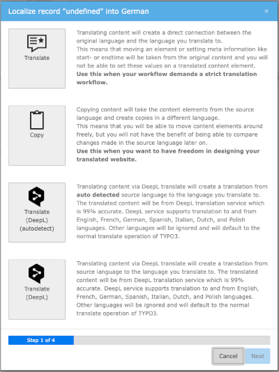

[](https://packagist.org/packages/web-vision/wv_deepltranslate)
[](https://packagist.org/packages/web-vision/wv_deepltranslate)
[](https://get.typo3.org/version/11)
[](https://get.typo3.org/version/12)
[](https://packagist.org/packages/web-vision/wv_deepltranslate)
[](https://packagist.org/packages/web-vision/wv_deepltranslate)

# TYPO3 extension `deepltranslate_core`

This extension provides automated translation of pages, content and records in TYPO3
for languages supported by [DeepL](https://www.deepl.com/de/docs-api/).

## Features

* Translate content elements via TYPO3 built-in translation wizard
* Single drop down translation parallel to regular page translation
  * Translate your page with all fields you want
* One-Click translation of single records
* Glossary support
  * Manage your own glossaries in TYPO3
  * Synchronise glossaries to DeepL API
  * Translate content using your glossaries



## Early-Access-Programm

Early access partners of DeepL Translate will benefit from exclusive access to all add-ons, developer preview versions, access to private GitHub repositories, priority support, logo placement and a backlink on the official website. You will also get access to the DeepL Translate version 5.0 announced for TYPO3 v13.

The following add-ons are currently available as part of the Early Access Program:

* **DeepL Translate Assets**: Translation of file meta data with DeepL
* **DeepL Translate Auto-Renew**: Automatic creation of pages and content elements in translations, renewal of translations when the original language changes
* **DeepL Translate Bulk**: Bulk translation of pages and content based on the page tree
* **Enable Translated Content**: Activation of all translated content elements with one click

Find out more: https://www.web-vision.de/en/deepl.html

## Installation

Install with your favour:

* [Composer](https://packagist.org/packages/web-vision/deepltranslate-core)
* [TER / Extension Manager](https://extensions.typo3.org/extension/deepltranslate_core/)
* [Git](https://github.com/web-vision/deepltranslate-core)

We prefer composer installation:
```bash
composer require web-vision/deepltranslate-core
```

The DeepL translation buttons are only displayed once you have set up the API
and desired target languages. Read the documentation to find out how to do this.

## Documentation

Read online: https://docs.typo3.org/p/web-vision/deepltranslate-core/main/en-us/

## Add-Ons

* [**DeepL Translate Glossary**](https://github.com/web-vision/deepltranslate-glossary):
  TYPO3-managed glossary for custom translation support

## Sponsors

We appreciate very much the sponsorships of the developments and features in
the DeepL Translate Extension for TYPO3.

### DeepL "Add automatic translation flag and hint" sponsored by

* [FH Aachen](https://www.fh-aachen.de/)
